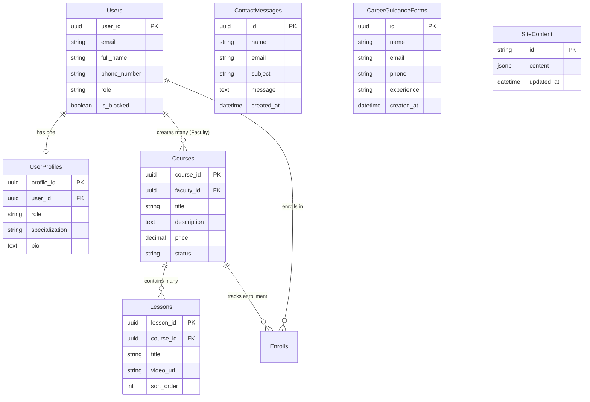

# Database Schema Specification
## Project: CodersSpot LMS Platform

This document defines the exact database structure for the CodersSpot LMS platform. It includes the original PostgreSQL/Prisma structure and maps it directly to the new **Django Models** using Django's built-in PostgreSQL capabilities.

---

## 1. Core Models & Tables

### 1.1. User Model (`Users` / `auth_user`)
The central user account model, supporting custom roles and OAuth options.

| Field Name (Prisma/DB) | Django Model Field Type | Options / Constraints | Description |
| :--- | :--- | :--- | :--- |
| `id` / `user_id` | `UUIDField` | Primary Key, `default=uuid.uuid4`, editable=False | Unique user ID |
| `email` | `EmailField` | Unique, index=True | User email address |
| `fullName` / `full_name` | `CharField` | max_length=255, null=True, blank=True | Full name of the user |
| `name` | `CharField` | max_length=255, null=True, blank=True | Nickname or legacy name |
| `passwordHash` | `CharField` | max_length=255, null=True (handled by Django Auth) | Encrypted password |
| `phoneNumber` / `phone_number` | `CharField` | max_length=50, null=True, blank=True | Phone number with country code |
| `role` | `CharField` | max_length=50, default="STUDENT" | Roles: `STUDENT`, `INSTRUCTOR`, `ADMIN` |
| `isBlocked` / `is_blocked` | `BooleanField` | default=False | Admin control to suspend account |
| `image` | `TextField` / `URLField` | null=True, blank=True | Google avatar or profile image URL |
| `createdAt` / `created_at` | `DateTimeField` | auto_now_add=True | Registration timestamp |
| `updatedAt` / `updated_at` | `DateTimeField` | auto_now=True | Profile update timestamp |

---

### 1.2. User Profile Model (`UserProfiles` / `user_profiles`)
Contains additional details for students or instructors. Created during the onboarding flow.

| Field Name (Prisma/DB) | Django Model Field Type | Options / Constraints | Description |
| :--- | :--- | :--- | :--- |
| `id` / `profile_id` | `UUIDField` | Primary Key, `default=uuid.uuid4` | Profile unique ID |
| `userId` / `user_id` | `OneToOneField` | Relation to `User`, on_delete=CASCADE | Link to parent User account |
| `role` | `CharField` | max_length=50 | Replicated role for quick queries |
| `specialization` | `CharField` | max_length=255, null=True | User stream (e.g., Full Stack, UI/UX) |
| `bio` | `TextField` | null=True, blank=True | User biography |
| `createdAt` / `created_at` | `DateTimeField` | auto_now_add=True | Creation timestamp |

---

### 1.3. Course Model (`Courses` / `courses`)
Courses created by faculty and approved by the administrator.

| Field Name (Prisma/DB) | Django Model Field Type | Options / Constraints | Description |
| :--- | :--- | :--- | :--- |
| `id` / `course_id` | `UUIDField` | Primary Key, `default=uuid.uuid4` | Course unique ID |
| `facultyId` / `faculty_id` | `ForeignKey` | Relation to `User`, on_delete=PROTECT | The instructor who created it |
| `title` | `CharField` | max_length=255, index=True | Course title |
| `description` | `TextField` | null=True, blank=True | Course description |
| `price` | `DecimalField` | max_digits=10, decimal_places=2, default=0.00 | Course price in INR |
| `status` | `CharField` | max_length=50, default="DRAFT" | Status: `DRAFT`, `PUBLISHED`, `ARCHIVED` |
| `createdAt` / `created_at` | `DateTimeField` | auto_now_add=True | Course creation time |
| `updatedAt` / `updated_at` | `DateTimeField` | auto_now=True | Last modified time |

---

### 1.4. Lesson Model (`Lessons` / `lessons`)
Curriculum steps inside courses. Ordered sequentially.

| Field Name (Prisma/DB) | Django Model Field Type | Options / Constraints | Description |
| :--- | :--- | :--- | :--- |
| `id` / `lesson_id` | `UUIDField` | Primary Key, `default=uuid.uuid4` | Lesson unique ID |
| `courseId` / `course_id` | `ForeignKey` | Relation to `Course`, on_delete=CASCADE | Parent course link |
| `title` | `CharField` | max_length=255 | Lesson title |
| `content` | `TextField` | null=True, blank=True | Text/Markdown lesson body |
| `videoUrl` / `video_url` | `URLField` | null=True, blank=True | Lecture video stream link |
| `sortOrder` / `sort_order` | `IntegerField` | default=0 | Display ordering within course |

---

## 2. Platform Lead Models

### 2.1. Contact Message Model (`ContactMessages` / `contact_messages`)
Stores leads submitted from the public contact form.

| Field Name (Prisma/DB) | Django Model Field Type | Options / Constraints | Description |
| :--- | :--- | :--- | :--- |
| `id` | `UUIDField` | Primary Key, `default=uuid.uuid4` | Message unique ID |
| `name` | `CharField` | max_length=255 | Sender's name |
| `email` | `EmailField` | | Sender's email |
| `subject` | `CharField` | max_length=255 | Selected message subject |
| `message` | `TextField` | | Message body |
| `createdAt` | `DateTimeField` | auto_now_add=True | Form submission time |

---

### 2.2. Career Guidance Model (`CareerGuidanceForms` / `career_guidance_forms`)
For leads requesting consulting.

| Field Name (Prisma/DB) | Django Model Field Type | Options / Constraints | Description |
| :--- | :--- | :--- | :--- |
| `id` | `UUIDField` | Primary Key, `default=uuid.uuid4` | Form unique ID |
| `name` | `CharField` | max_length=255 | Applicant's name |
| `email` | `EmailField` | | Applicant's email |
| `phone` | `CharField` | max_length=50 | Applicant's phone number |
| `experience` | `CharField` | max_length=100 | Selected experience bracket |
| `createdAt` | `DateTimeField` | auto_now_add=True | Form submission time |

---

## 3. Platform CMS Model

### 3.1. Site Content Model (`SiteContent` / `site_content`)
Stores raw JSON values representing custom page headlines, banners, features, and teams directory.

| Field Name (Prisma/DB) | Django Model Field Type | Options / Constraints | Description |
| :--- | :--- | :--- | :--- |
| `id` | `CharField` | Primary Key, max_length=255 | Section key (e.g., `about`, `landing`) |
| `content` | `JSONField` | default=dict | Arbitrary section key-value mappings |
| `updatedAt` | `DateTimeField` | auto_now=True | Last modified timestamp |

---

## 4. Database Relationship Diagram (Mermaid)

