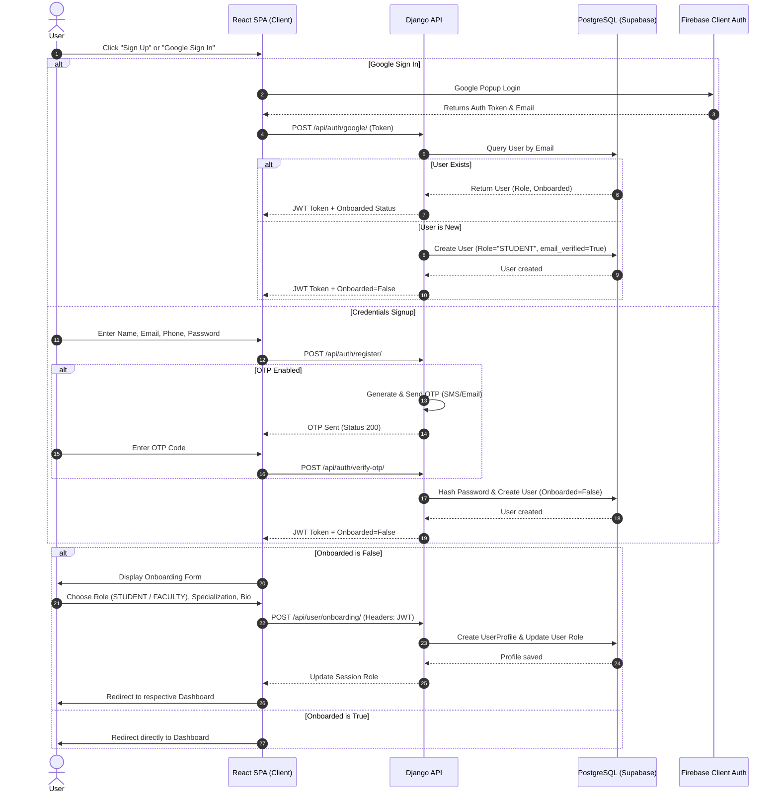
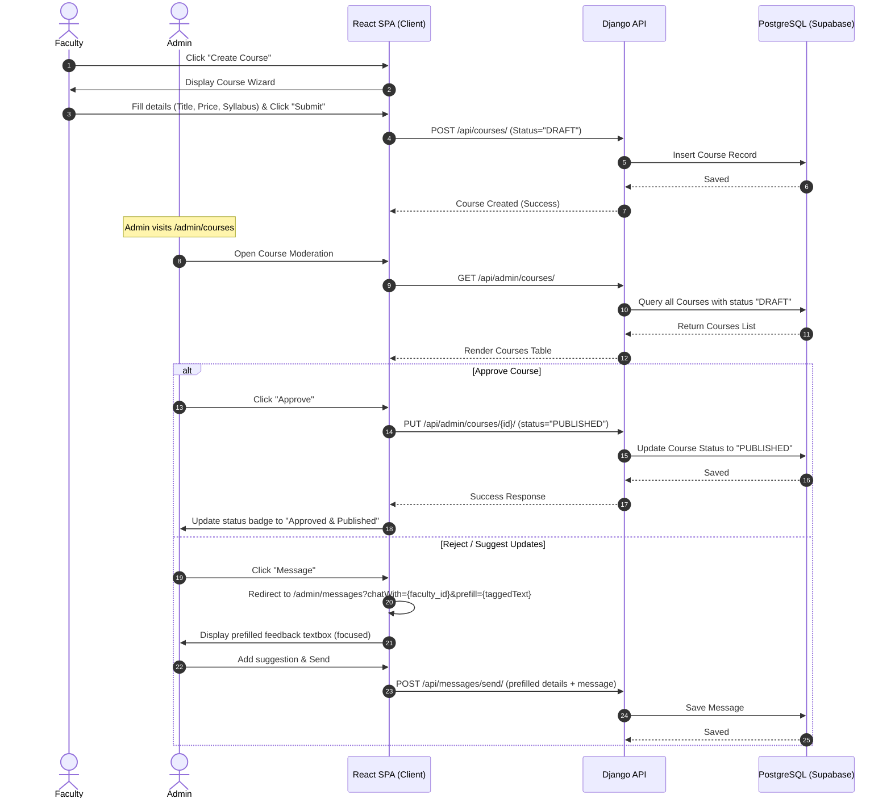

# Dataflow & Wireframe Specification
## Project: CodersSpot LMS Platform

This document outlines the core transaction dataflows, structural layouts, and user interface wireframes for the CodersSpot LMS platform.

---

## 1. System Dataflows (Sequence Diagrams)

### 1.1. User Registration & Onboarding Flow
Handles user registration, optional Phone/Email OTP checks, Google Auth linking, and role-based onboarding.



---

### 1.2. Course Upload & Admin Approval Workflow
Ensures no course goes public without admin review and consent.



---

## 2. Wireframe & Structural Layouts

### 2.1. Public Landing Page Layout
High-end, responsive layout utilizing dark modes, gradient backgrounds, and subtle scroll indicators.

```
+-----------------------------------------------------------------------------------+
|  [Logo] Lumina        Courses   About   Placements   Testimonials   [Theme] [Auth]|
+-----------------------------------------------------------------------------------+
|                                                                                   |
|         Build skills that [ SHIP REAL PRODUCTS ] <--- (Shimmer Gradient Text)      |
|         Interactive project cohorts led by expert faculty.                        |
|                                                                                   |
|              [ Get Started (Primary) ]    [ Explore Courses (Ghost) ]             |
|                                                                                   |
|   +---------------------------------------------------------------------------+   |
|   |  Stats Strip:                                                             |   |
|   |  10,000+ Students  |  98% Satisfaction  |  4.9★ Rating  |  $34M+ Salary   |   |
|   +---------------------------------------------------------------------------+   |
|                                                                                   |
|   Features Bento Grid:                                                            |
|   +----------------------------------+ +--------------------------------------+   |
|   | Project-Based Learning           | | Live Cohorts                         |   |
|   | (Stretches 2/3 cols)             | | (1/3 col card)                       |   |
|   +----------------------------------+ +--------------------------------------+   |
|   +----------------------------------+ +--------------------------------------+   |
|   | Verified Credentials             | | Career Placements                    |   |
|   | (1/2 col card)                   | | (1/2 col card)                       |   |
|   +----------------------------------+ +--------------------------------------+   |
|                                                                                   |
+-----------------------------------------------------------------------------------+
```

---

### 2.2. Split-Pane Auth Page Layout (`/auth`)
Left pane contains branding assets and trust anchors; right pane houses login/signup action selectors.

```
+------------------------------------------+----------------------------------------+
| LEFT PANEL (Hidden on Mobile)            | RIGHT PANEL                            |
| Background: .dot-grid + Violet Orb       |                                        |
|                                          |           [ Sign In ]   [ Sign Up ]     |
| [Logo] Lumina                            |                                        |
|                                          |    Full Name                           |
| Headline:                                |    [                               ]   |
| "Learn from engineers who have shipped   |                                        |
| production code at scale."               |    Email Address                       |
|                                          |    [                               ]   |
| Feature Bullets:                         |                                        |
| - Interactive video classroom            |    Password                            |
| - Dedicated Discord support channels     |    [                               ]   |
| - Verified job references                |                                        |
|                                          |    Role Selection:                     |
| Testimonial Card (Glassmorphic):         |    ( ) Student          ( ) Faculty    |
| "This platform changed my career path."  |                                        |
| - Sarah K., Software Engineer            |              [ Submit Button ]         |
+------------------------------------------+----------------------------------------+
```

---

### 2.3. Student Portal Layout (`/student`)
Dynamic sticky navigation header combined with dynamic layouts for bento modules.

```
+-----------------------------------------------------------------------------------+
|  [Logo] Student  Overview  My Courses  Assignments  Live [Pulse]  Messages  [SG]  |
+-----------------------------------------------------------------------------------+
|                                                                                   |
|   Welcome back, Student! [ Live Cohort Starts In: 02h 45m ] ---> (RSVP Pill)       |
|                                                                                   |
|   Metrics Cards:                                                                  |
|   +-------------+  +-------------+  +-------------+  +-------------+              |
|   | Enrolled: 3 |  | Streak: 12d |  | Time: 14.5h |  | Certificates|              |
|   +-------------+  +-------------+  +-------------+  +-------------+              |
|                                                                                   |
|   Bento Layout (2:1 Grid):                                                        |
|   +------------------------------------------+ +------------------------------+   |
|   | Continue Learning                        | | Next Live Cohort             |   |
|   | Course: System Design                    | | Topic: DB Sharding           |   |
|   | Progress: [========------] 68%           | | Instructor: Marcus Chen      |   |
|   | [ Resume Class ]                         | | [ Join Cohort (Cyan) ]       |   |
|   +------------------------------------------+ +------------------------------+   |
|                                                                                   |
+-----------------------------------------------------------------------------------+
```

---

### 2.4. Admin Courses Moderation console (`/admin/courses`)
Secure workspace featuring tabular filters and actionable controls for course vetting.

```
+-----------------------------------------------------------------------------------+
|  [Logo] Admin  Overview  Users  [Courses]  Messages  CMS  Leads  Settings   [SA]  |
+-----------------------------------------------------------------------------------+
|                                                                                   |
|   Global Course Catalog                                                           |
|   Review, approve, reject, or edit faculty courses across the platform.            |
|                                                                                   |
|   Filters: [ All Statuses \/ ]   [ Search courses...                        ]     |
|                                                                                   |
|   Data Table:                                                                     |
|   +------------------------------------+----------------+---------+-----------+   |
|   | Course Title                       | Instructor     | Status  | Actions   |   |
|   +------------------------------------+----------------+---------+-----------+   |
|   | Intro to AI/ML & Python            | Sarah Jenkins  | DRAFT   | [Approve] |   |
|   | Learn basics from scratch.         |                |         | [Edit]    |   |
|   |                                    |                |         | [Message] |   |
|   +------------------------------------+----------------+---------+-----------+   |
|   | Full Stack React & Next.js         | Sarah Jenkins  | ACTIVE  | [Demote]  |   |
|   | Master frontend design frameworks. |                |         | [Edit]    |   |
|   |                                    |                |         | [Message] |   |
|   +------------------------------------+----------------+---------+-----------+   |
|                                                                                   |
+-----------------------------------------------------------------------------------+
```
