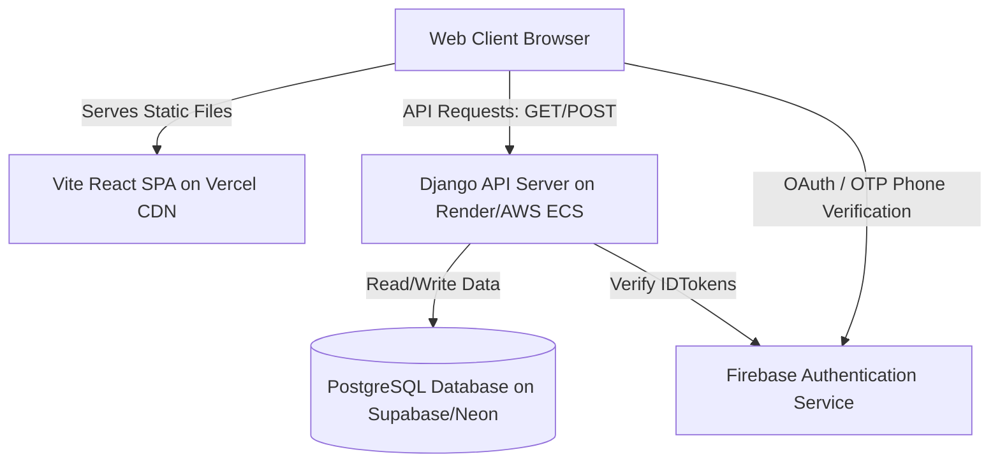

# Technical Requirements Document (TRD)
## Project: CodersSpot LMS Platform

This document outlines the core technical dependencies, runtime environments, deployment infrastructure, and stability checklist for the CodersSpot React + Django migration.

---

## 1. Technical Stack & Dependencies

### 1.1. Frontend Environment (SPA Client)
*   **Core Framework**: React 19 + TypeScript
*   **Build Tool**: Vite (for fast, runtime-independent compilation)
*   **Styling**: Tailwind CSS v4 (incorporating our custom dual-theme CSS variables)
*   **Router**: React Router v7 (configured with Role-based Protected Routes)
*   **Key Libraries**:
    *   `axios` — HTTP client with interceptors for token auto-refresh
    *   `firebase` — Client SDK (Phone auth OTP trigger and confirmation)
    *   `framer-motion` — Micro-animations, slide drawers, page transitions
    *   `lucide-react` — Standard iconography set

### 1.2. Backend Environment (REST API Server)
*   **Language**: Python 3.12+
*   **Web Framework**: Django 5.1+
*   **REST API Toolkit**: Django REST Framework (DRF)
*   **Authentication**: Simple JWT (JSON Web Token handling)
*   **Database Adapter**: `psycopg3` (PostgreSQL interface)
*   **WSGI/ASGI Server**: `gunicorn` (production WSGI server) + `uvicorn` (ASGI for WebSockets)
*   **Realtime Layer**: Django Channels (WebSockets for chat synchronization)
*   **Background Tasks**: Celery + Redis (optional, for processing video optimizations / certificate generation)

---

## 2. Infrastructure & Hosting Architecture



*   **Frontend Hosting (Vercel CDN)**:
    *   React bundle compiled to static assets (`dist/`) during build.
    *   No Node.js runtime required on Vercel. **No build-time environment variable crashes**.
*   **Backend Hosting (Render / Heroku / AWS ECS)**:
    *   Persistent VM running Django Gunicorn/Uvicorn process.
    *   Connected to the PostgreSQL database.
*   **Database (Supabase / Neon)**:
    *   Hosted PostgreSQL instance.
    *   Requires connection pool limits configured (e.g., maximum 20 connections for serverless, or persistent connections for Django).

---

## 3. Firebase Web & Admin Integration

To authenticate users via their Phone Number / OTP, the platform splits Firebase operations:

### 3.1. Frontend Phone OTP (Firebase Web SDK)
1.  Initialize Firebase Client SDK in `lib/firebase.ts`.
2.  Use the `RecaptchaVerifier` to verify the user is human.
3.  Call `signInWithPhoneNumber(auth, phoneNumber, appVerifier)` to send the OTP.
4.  User enters the OTP, and the client calls `confirmationResult.confirm(otpCode)` to get a **Firebase IDToken** (`credentials.idToken`).
5.  Send the `idToken` to the Django backend via `POST /api/auth/verify-otp/`.

### 3.2. Backend Verification (Firebase Admin Python SDK)
1.  The Django backend receives the `idToken`.
2.  Verify the token securely with the Firebase Admin SDK:
    ```python
    import firebase_admin
    from firebase_admin import auth, credentials
    
    # Initialize only if not already done
    if not firebase_admin._apps:
        cred = credentials.Certificate(settings.FIREBASE_CREDENTIALS_DICT)
        firebase_admin.initialize_app(cred)
        
    try:
        decoded_token = auth.verify_id_token(id_token)
        phone_number = decoded_token.get('phone_number')
        # Token is authentic! Fetch or create the User account associated with this phone.
    except Exception as e:
        raise AuthenticationFailed("Invalid token credentials")
    ```

---

## 4. Stability & Security Checklist

*   [ ] **Zero Build-Time Secrets Dependency**: The frontend build command (`npm run build`) must not require any API keys or secrets to compile successfully. All credentials must be read dynamically from client-side config or backend API responses.
*   [ ] **HttpOnly JWT Session Cookies**: The JWT Refresh token must be returned from the Django backend in a secure, `HttpOnly`, `SameSite=Lax` cookie. This prevents XSS attacks from reading user session data.
*   [ ] **CORS Configuration**: The Django backend must specify strict allowed origins:
    ```python
    CORS_ALLOWED_ORIGINS = [
        "https://codersspot.com",
        "https://www.codersspot.com",
    ]
    CORS_ALLOW_CREDENTIALS = True
    ```
*   [ ] **Database Connection Pools**: Ensure that the database URL has pooling parameters configured (e.g., `?sslmode=require&pool_timeout=30`) to prevent connection exhaustion.
*   [ ] **Auto-Downgrade Super Admin Guard**: Replicate the exact email role check inside the Custom User `save()` hook in Django to enforce `codersspot97@gmail.com` as the only Super Admin.
